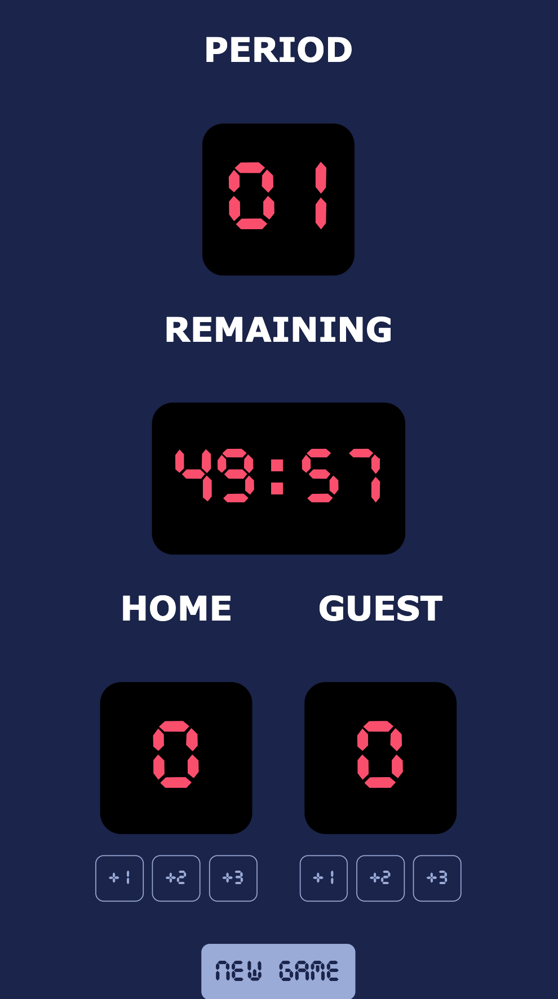

# Basketball Dashboard



## Introduction

An interactive dashboard for basketball.

## Feature

- **countdown**
- **interactive counter**
- **start new period**

## Tech Stack

Use `html-css-javascript` to build frontend

## Getting Started

```bash
git clone https://github.com/boy-johnny/scrimba_basketball_dashboard/
npm install
npm start
```

## Project Structure

```
🏀 scrimba-basketball-dashboard
├── index.html
├── index.js
├── index.css
├── README.md
└── package.json
└── vite.config.js
└── preview.png
```


## Reference

Designed by **[Scrimba](https://scrimba.com/)**
